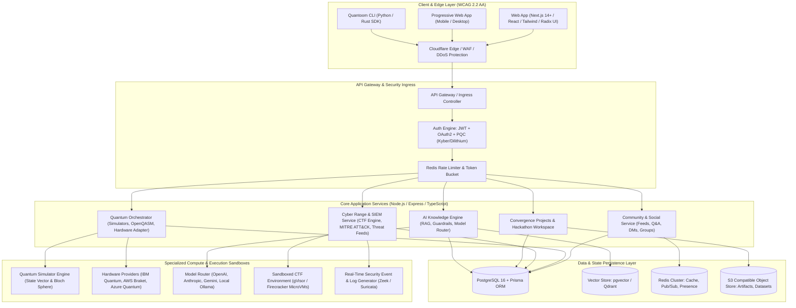
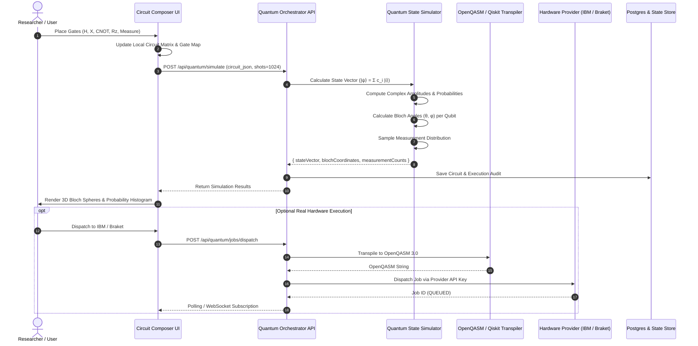
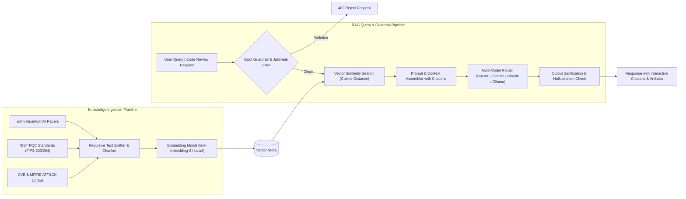
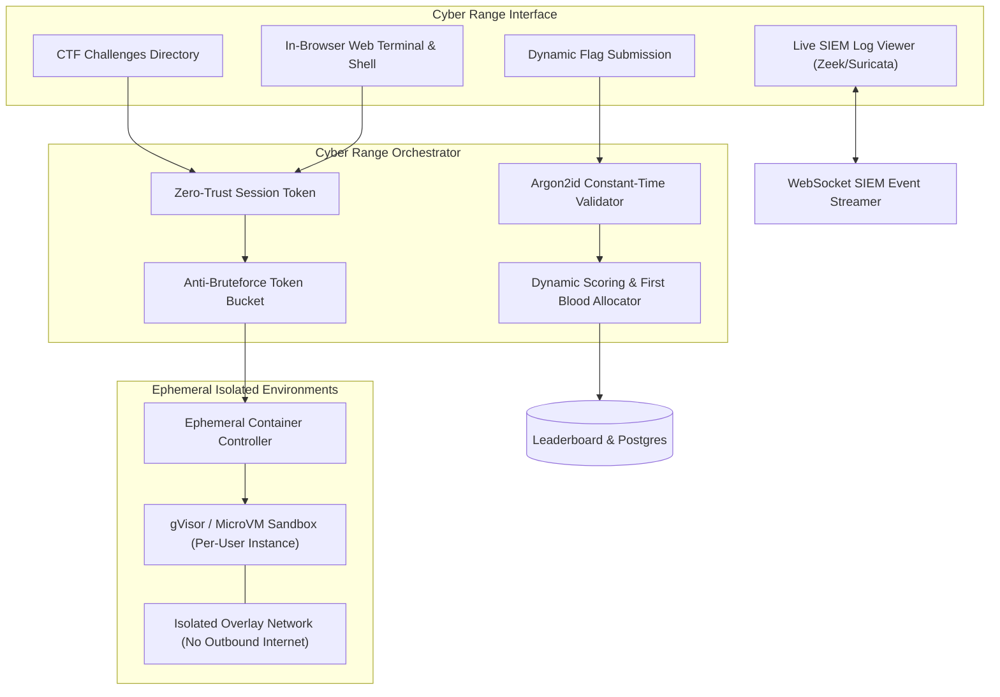

# System Architecture & Technical Specifications
## Quantoom Root — Unified Quantum + AI + Cybersecurity Community Platform
**Document Version:** 1.0.0  
**Target Infrastructure:** Cloud-Native / Multi-Cloud / Kubernetes Ready  

---

### 1. High-Level System Architecture Diagram

---

### 2. Quantum Computing Hub Architecture

---

### 3. AI Copilot & Knowledge Engine (RAG Pipeline)

---

### 4. Cybersecurity Range & Zero-Trust Isolation Architecture

---

### 5. Post-Quantum Cryptography Hybrid Architecture

To safeguard sensitive credentials, API keys for quantum hardware, and encrypted community DMs against **Harvest Now, Decrypt Later (HNDL)** attacks by quantum adversaries running Shor's algorithm, Quantoom Root implements a hybrid post-quantum envelope:

1. **Key Encapsulation (KEM)**: Combines classical ECDH (Curve25519) with NIST FIPS 203 **ML-KEM (CRYSTALS-Kyber-768)**.
2. **Digital Signatures**: Combines Ed25519 with NIST FIPS 204 **ML-DSA (CRYSTALS-Dilithium-3)** for tamper-proof verification of quantum hardware credentials and CTF flags.
3. **Session Master Key Derivation**:
   $$K_{master} = \text{HKDF-Extract-Expand}(\text{ECDH}_{secret} \parallel \text{Kyber}_{shared\_secret}, \text{Salt})$$

---

### 6. Database & Persistent Storage Topology

- **Primary Relational Store**: PostgreSQL with schema enforcement for users, reputation, posts, quantum circuits, jobs, CTF challenges, and SIEM logs.
- **Cache & Presence Store**: Redis 7 cluster managing active user presence, rate limiting buckets, Pub/Sub channels for real-time DMs and SIEM alert broadcasts.
- **Vector Store**: pgvector / Qdrant handling 1536-dimensional embeddings for research papers, code repositories, and documentation.
- **Object Storage**: S3-compatible MinIO/AWS S3 storing user avatars, exported circuit diagrams, notebook archives, and CTF binary artifacts.
